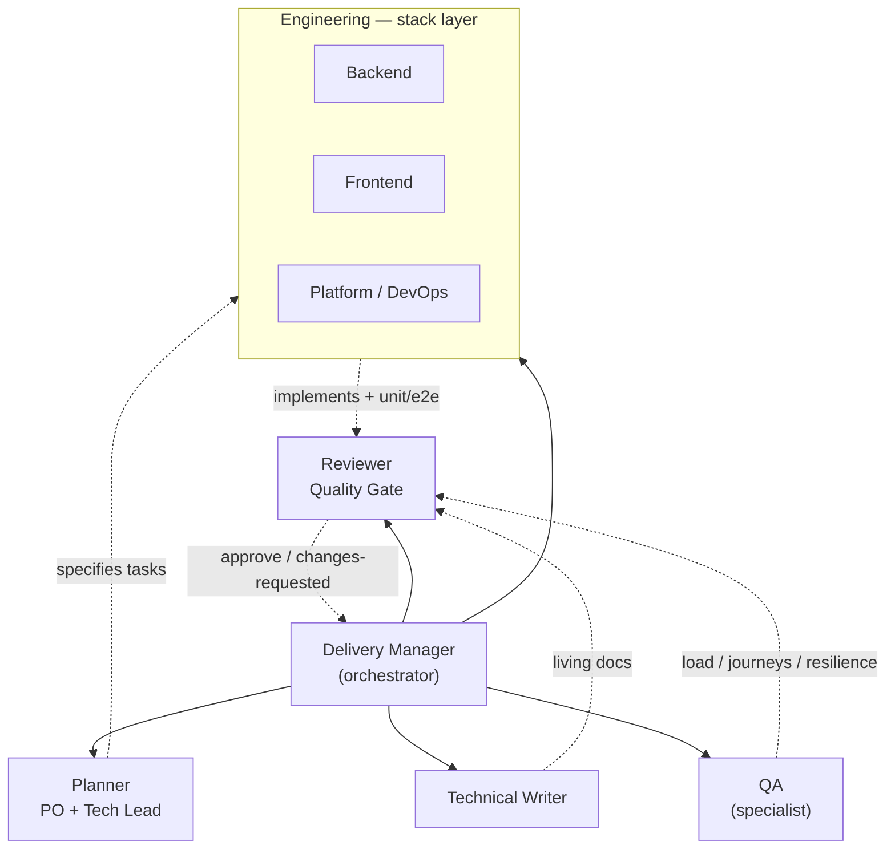

# agents-foundation — Claude Code plugin marketplace

A reusable delivery foundation for Claude Code, packaged as a plugin marketplace. Install it into any project to get a team of role agents, a `work/` markdown kanban, and deterministic gates that keep the board honest.

It ships two plugins — install one or both:

- **`delivery-team`** — the agnostic process: role agents (planner, reviewer, docs, qa, product-delivery-manager), the `work/` kanban, the deterministic board/docs/verdict gates, and the `/delivery-team:init` scaffolder. Carries *how work flows*, not *which stack you use*.
- **`stack-turbo-nest-react`** — an opinionated stack layer (v0, as-built): NestJS + React/Turborepo implementer agents and their conventions. Depends on `delivery-team`. The `stack-*` prefix is the convention for future stacks.

## How it works

**Agents create and judge; deterministic steps apply state; hooks enforce it.** The reviewer returns a structured verdict → `/delivery-team:apply-verdict` ticks the Acceptance Criteria and moves the task → a board gate refuses `done/` without a verdict + ticked criteria → a docs gate refuses a migration without an ERD/docs update. Bookkeeping is code, not an agent's memory.

Gates run in **two layers**: agent-time `PreToolUse` hooks ship in the plugin (resolved via `${CLAUDE_PLUGIN_ROOT}`); the commit-time git gate is wired by `/delivery-team:init`, which copies the validators into the consumer repo because git hooks can't see `${CLAUDE_PLUGIN_ROOT}`.

## Roles & org chart

The team splits into a **process layer** (`delivery-team`, agnostic) and a **stack layer** (`stack-turbo-nest-react`, opinionated). The Delivery Manager orchestrates: the planner specifies, implementers build, docs and QA run alongside when warranted, and the reviewer is the gate.



| Agent | Persona | Layer | Role |
| --- | --- | --- | --- |
| [planner](plugins/delivery-team/agents/planner.md) | Product Owner + Tech Lead | delivery-team | turns a goal into a well-formed task (Spec + Plan + Todo + Verdict + Log) |
| [reviewer](plugins/delivery-team/agents/reviewer.md) | Quality Gate | delivery-team | judges the diff vs the contract; its verdict drives `apply-verdict` + the gate |
| [docs](plugins/delivery-team/agents/docs.md) | Technical Writer | delivery-team | living C4 docs and ERDs |
| [qa](plugins/delivery-team/agents/qa.md) | QA Engineer (specialist) | delivery-team | load / journeys / resilience / coverage — not the per-feature path |
| [product-delivery-manager](plugins/delivery-team/agents/product-delivery-manager.md) | Delivery Manager | delivery-team | reads the board, dispatches, integrates, ships |
| [backend](plugins/stack-turbo-nest-react/agents/backend.md) | Software Engineer | stack-turbo-nest-react | server-side feature work + its own tests |
| [frontend](plugins/stack-turbo-nest-react/agents/frontend.md) | Software Engineer | stack-turbo-nest-react | UI/app feature work + its own tests |
| [infra](plugins/stack-turbo-nest-react/agents/infra.md) | Platform / DevOps | stack-turbo-nest-react | platform / CI / deploy tasks |

> Backlog replenishment (`/delivery-team:task-promote`) and verdict application (`/delivery-team:apply-verdict`) are **deterministic skills**, not agents — bookkeeping is code, not an agent's discretion.

## Structure

```
agents-foundation/
├── .claude-plugin/marketplace.json     # marketplace manifest (lists the plugins)
└── plugins/
    ├── delivery-team/                  # Plugin A — agnostic process
    │   ├── .claude-plugin/plugin.json
    │   ├── agents/ commands/ hooks/ scripts/ rules/ templates/
    │   └── README.md
    └── stack-turbo-nest-react/         # Plugin B — opinionated stack (v0)
        ├── .claude-plugin/plugin.json
        ├── agents/ rules/
        └── README.md
```

A plugin's components live at the **plugin root** (`agents/`, `commands/`, `hooks/`), never under a `.claude/` folder — that's why you don't see one here. The consumer repo *does* get a `.claude/`, created by `/delivery-team:init`: it materializes the rules + gate scripts and scaffolds `work/`. `rules/` and `scripts/` aren't native plugin component types — they ride along as files and `/delivery-team:init` copies them in.

## Use it in a project

```
/plugin marketplace add <owner>/agents-foundation         # GitHub shorthand, or a full git URL
/plugin install delivery-team@agents-foundation
/plugin install stack-turbo-nest-react@agents-foundation  # optional opinionated layer
/delivery-team:init                                       # one-time scaffold in the target repo
```

Then drive the workflow: `/delivery-team:task-new <goal> → /delivery-team:task-start → reviewer → /delivery-team:apply-verdict`.

- **Scope**: `--scope user` (default) follows you across repos and machines; `--scope project` (committed `.claude/settings.json`) shares it with a team.
- **Updates**: each `plugin.json` pins a `version` — consumers update with `/plugin marketplace update agents-foundation`.
- **Coexistence**: a project's own `.claude/` and installed plugins merge; on a name clash the project-local copy wins — so a consumer can run a pinned published version while the foundation keeps evolving.

## How it compares (vs. prompt-canvas methods like SPDD)

Prompt-canvas methods — notably [SPDD (Structured Prompt-Driven Development)](https://martinfowler.com/articles/structured-prompt-driven/) — share our core conviction: make intent explicit and versioned *before* code, and keep humans in control through judgment, not typing. We agree with that, and we adopted their best idea (see the last row). Where this foundation goes further:

| | **agents-foundation** | Prompt-canvas (e.g. SPDD) |
| --- | --- | --- |
| **Enforcement** | **Deterministic & non-bypassable** — hooks + scripts refuse `done/` without a recorded verdict and every Acceptance Criterion ticked | Process discipline + manual review; nothing mechanically blocks a skipped step |
| **State tracking** | Explicit git-native kanban (folder = state), dependency graph, auto-replenish (`task-promote`) | Tracked implicitly through commits |
| **Team / scale** | Multi-agent orchestration: parallel implementers in isolated worktrees, model tiering (Sonnet workers / Opus reviewer) | One developer + AI, sequential steps |
| **Standards** | Strong **rules applied to every task** — impossible to forget; the reviewer interprets them | Declared **per feature** in the canvas — relies on the author remembering each time |
| **Reusability** | A reusable, installable marketplace: agnostic process layer + swappable `stack-*` layers | A single methodology + its CLI |
| **Judgment vs. bookkeeping** | Split by construction: agents judge, deterministic scripts apply state, hooks enforce | Review and application are largely manual |

The sharpest difference is the **standards** row. A canvas trusts the author to restate the security/perf/structure constraints on every feature; people forget, and the gap ships silently. We keep those as **strong rules enforced for all tasks**, so a constraint can't be left out of one task by accident.

What we took *from* the canvas: **abstraction-first** (model the domain and module boundaries before writing code). We adopted it the house way — as a rule the planner applies to every task and the reviewer checks — rather than a section an author can forget to fill.

> TL;DR — if you want a *method a disciplined developer follows*, a prompt canvas is fine. If you want a *system that won't let the process be skipped*, and that scales to a team of agents, use this.

## Contributing

A marketplace is just a git repo — no registry.

- Edit a plugin under `plugins/<name>/`; components are auto-discovered from the plugin root.
- Keep `delivery-team` stack-agnostic; put stack specifics in a `stack-*` plugin.
- **Releasing a change**: bump `version` in the relevant `plugin.json` *and* its entry in `marketplace.json`. (Omit `version` only if you'd rather every commit be an update.)
- **Conventions**: every versioned artifact in English; Conventional Commits (single imperative line, no AI signature).

## Roadmap / known caveats

- **Last doc-layer leak** — the reviewer is rule-driven and the migration↔ERD gate (`validate-docs.mjs`) now lives in the stack plugin. What remains is the `docs.md` *rule* text, which still describes a C4/services-monorepo layout; split it so only universal doc discipline stays in `delivery-team`.
- **Opinionated stack is v0 as-built** — codify the de-facto design pattern (folder shape, naming, import boundaries) into explicit conventions, and add a structure-lint (ESLint boundaries / dependency-cruiser) so organization is a deterministic gate, not a reviewer judgment call.
- **Hard plugin dependency** — `stack-turbo-nest-react` depends on `delivery-team` only in prose; confirm whether a real dependency field can enforce it.
- **`/delivery-team:init` portability** — the commit-gate wiring assumes pnpm/husky (with a plain `.git/hooks/pre-commit` fallback); the `.mjs` validators require Node. Harden and document the prerequisites.
- **End-to-end validation** — exercise the full loop (`marketplace add` → install → `/delivery-team:init` → `/delivery-team:task-new … → board-gate`) in a throwaway repo to confirm hooks fire and gates actually block.
